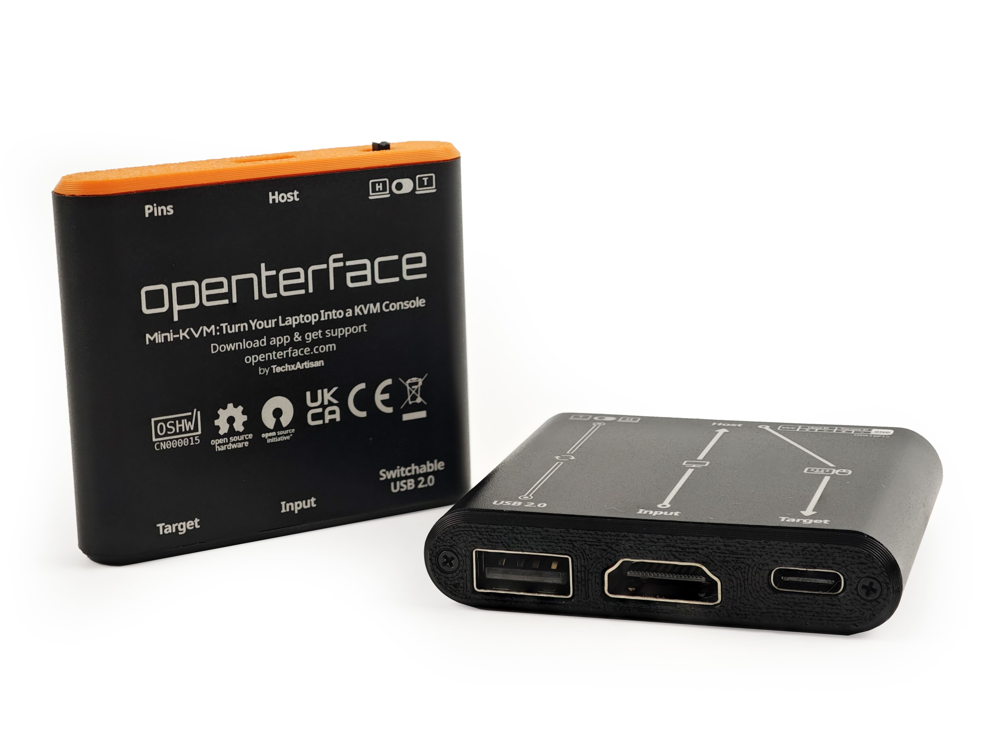

# Quick Start

{:style="max-height:420px"}

Our **Openterface™ Mini-KVM** enables you to control a nearby headless computer directly from your own laptop or desktop using USB and HDMI connections, eliminating the need for additional peripherals or network connectivity. Throughout this documentation, we refer to your controlling laptop or desktop as the **Host** ( {:style="height:18px"} {:style="height:15px"} ) and the device being controlled as the **Target** ( {:style="height:18px"} {:style="height:18px"} ).

-   :material-feature-search-outline:{ .lg .middle } __Features__

    ---

    Explore the powerful features of Openterface™ Mini-KVM

    [:octicons-arrow-right-24: View Features](/features)

-   :material-power-plug:{ .lg .middle } __How to Connect__

    ---

    Set up your Openterface™ Mini-KVM and start controlling your Target device

    [:octicons-arrow-right-24: Connection Guide](/how-to-connect)

-   :material-open-source-initiative:{ .lg .middle } __Host Apps__

    ---

    Control your Target device seamlessly with our user-friendly Host applications

    [:octicons-arrow-right-24: Download Host App](/app)

-   :material-chip:{ .lg .middle } __Open Hardware__

    ---

    Explore our commitment to open-source hardware and transparency

    [:octicons-arrow-right-24: Open Hardware Details](/open-hardware)

-   :material-frequently-asked-questions:{ .lg .middle } __Use Cases & FAQs__

    ---

    Explore ideal scenarios for Openterface™ Mini-KVM and find answers to common questions

    [:octicons-arrow-right-24: Explore Use Cases](/use-cases)
    
    [:octicons-arrow-right-24: View FAQs](/faq)

-   :material-compare:{ .lg .middle } __Comparison__

    ---

    See how Openterface™ Mini-KVM stacks up against other KVM solutions

    [:octicons-arrow-right-24: Why Openterface?](/why-openterface)

    [:octicons-arrow-right-24: View Comparison](/comparison)

